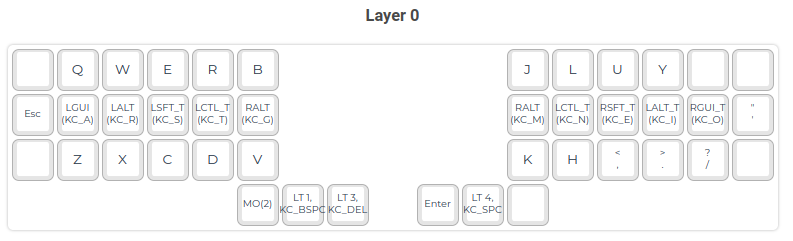
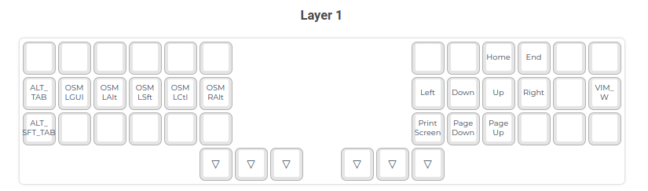
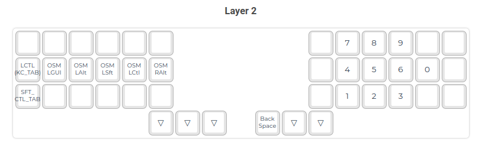
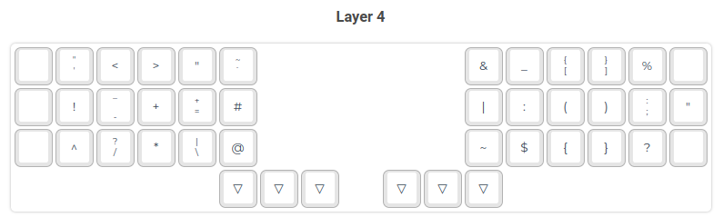

# 42 keys layout

Created: 21.02.2023
Last updated: 21.02.2023

I developed the initial version of this layout on my Sofle V2 (52 keys) but then I realized that I don't need that many keys.
I migrated it to tbk-mini (42 keys) and I have been using it in the current form for almost 4 months.

## Why I wrote this

I wrote this blog post mainly to document my layout journey so far, before the details evaporate.
I hope that it will be useful also for other people who are just staring with programmable keyboards.
Last but not last I wanted to ask more experienced QMK users for some feedback, but it is impossible to get anything meaningful without
fully explaining why the things are in the current form.

## Goals

These very my goals when developing that layout:

- use not more than 42 keys
- don't use pinky fingers for modifiers or any other frequently used keys like bspc or enter
- support two languages: English and Polish (with emphasizes on the former)
- tmux & vim friendly but still be a general purpose layout
- programmer friendly (I write scala but not exclusively)
- intuitive
  - keys that are present on multiple layers should be at the same place
  - similar things should be done in similar ways

I think that I should explain what I mean by general purpose layout.
I want it to be almost as good as it is for vim and tmux for any other program.
So, if there is a program that uses combination like `LCTL`+`LSFT`+`F12` I should be able to type it fairly easy even though this is not something that I use on a daily basis.
This also corresponds to that goal, but I want to stress that I don't want to have keys that are very specific to a particular program. For example the default mapping for rename action in IJ is `LSFT`+`F6` and I don't want to have a single one specific key that does that. Although having all F-keys shifted on some layer would be fine.

## Alpha layer

I wanted something more efficient than QWERTY. Initially I though about going with DVORAK, mostly because I was unaware of alternatives.
I went with COLEMAK-DH which is quite a popular choice these days from what I have seen, and it seemed like a safe bet.
COLEMAK is also not terrible when it comes to writing Polish, it is not as good as for other languages like English or German but still betters than QWERTY.

I use home row mods. I simply followed [precondition's guide](https://precondition.github.io/home-row-mods#gasc) and settled on the `GASC` order
with a slight modificatin of having `AltGr` on the most inner column on both sides. I need `AltGr` to access some polish letters.
Putting it in the most inner column turned out to be a good choice since it is fairly easily accessible
but I don't have to access it very often (that might be specific to me as I often don't use these special letters but their standard counterpart when writing in Polish).

Regarding home row mods is is important to configure your keyboard correctly. I started with [`IGNORE_MOD_TAP_INTERRUPT`](https://docs.qmk.fm/#/tap_hold?id=ignore-mod-tap-interrupt). I tried using [`PERMISSIVE_HOLD`](https://docs.qmk.fm/#/tap_hold?id=permissive-hold) but that resulted in many misfires. Then I decided to try [Achordion](https://getreuer.info/posts/keyboards/achordion/index.html) and it worked like a charm. After that I brought back `PERMISSIVE_HOLD` and everything works as is should now :)

I put `Esc` on the most outer column on the left half as neovim is my editor of choice.
The key above the `Esc` is quite far away and I didn't find any key that would fit this place. Similar concerns apply to the key below it.
Suggestions are welcome. This might be also an indication that I should try a smaller keyboard like 5x3.

On the right half the story is similar. The middle key of the outer column is `"` which offers a quite convenient access to the vim registers and to quoting in general.
I don't use the other two keys from this column.
I even don't use the upper key from the second most outer column as in colemak that is `;` and it is simply too inconvenient to use it.

## Thumb keys

I decided to cover them separately because they are almost identical on all layers which I think contributes to the goal of being an intuitive.
They look as follows:

[number layer][`bspc`/navigation layer][`del`/function layer] |||| [`enter`][`space`/symbol layer][N/A]

The middle thumb keys are in a natural position for my thumb and because of that they have the most important functions.

Having `bspc` and `space` under your thumbs is very nice.

One function that is hard to visualize on the image is the access to the last layer(`TMUX`) which is done by holding both main thumb keys (`bspc`+`space`).
Such combination is very convenient to enter but notice that after doing that your both thumb keys are immobilized which makes it suitable only for a very specific layers.

Additional resources:

- https://johnlindquist.com/an-opinionated-guide-to-keyboard-thumb-keys/

## Note about additional layers

Most of additional layers follow a similar design.
On one half I have [OSMs](https://github.com/qmk/qmk_firmware/blob/master/docs/one_shot_keys.md) and the other one contains keys that are specific to the given layer.
In addition to that, I found it unnatural to use keys from the same half that I am holding the layer switch on.
Hence, I try to put the layer switch on the opposite side to the keys on that layer.

## Navigation layer

Quite standard navigation layer with arrows on the right side arranged like hjkl in vim.
OSMs are on the left. In addition `HOME`/`END` and `PG_UP`/`PG_DN` are added as they conceptually fit into that layer.
I recently added `PrintScreen` as is is useful and from the lack of preference I just put it here.

But what is this `VIM_W` you may ask. Doesn't it violate the rule that the keyboard layout should not be program specific?
Yes, you are right. I should've change it to something like `F13` and remap that key in the vim settings to save action.
For now I was just too lazy to do it :)

## Numbers layer

Numbers are on the right side, so the layer switch is on the left thumb cluster.

Before I got to this point I did a few iterations.
First, I started from the numbers on the home row ordered including their frequency of use as in https://www.jonashietala.se/blog/2021/06/03/the-t-34-keyboard-layout .
This turned out the be really confusing and given that it was my begging with colemak and split keyboard I didn't have any mental capacity left to learn it.
Next, I ordered them naturally which helped a lot with the mental effort but there was no easy way to enter combinations like `Alt`+number
(OSM solves that to a degree, but I didn't know about them at that point).

After that I put them in the form of keypad with 1,2,3,0 in the middle as they are used the most.
That was much better then anything before but after some time I decided that the benefit from the frequency-based ordering isn't worth the additional cognitive effort,
and I changed them to be like in a regular keypad. I decided to keep the `0` in the middle row (at first mainly because I didn't have any better idea where to put it).
This turned out pretty well as zero is definitely the one that is used the most, so having it on the home-row pays off.

## Symbols layer

Second most challenging layer right after the main one.
Luckily, Pascal Getreuer already did the hard job and researched that topic - [Designing a Symbol Layer](https://getreuer.info/posts/keyboards/symbol-layer/index.html).
Obviously, before going with this one I spent few days looking at possible altternatives.

Additional resources:

- https://www.jonashietala.se/blog/2021/06/03/the-t-34-keyboard-layout/
- https://decorous-derby-cf1.notion.site/Thoughts-on-keyboard-layouts-63ee6a98536044d394d178a807426972
- https://github.com/manna-harbour/miryoku/tree/master/docs/reference
- https://github.com/qmk/qmk_firmware/tree/master/keyboards/ferris/keymaps/default
- https://keymapdb.com/keymaps/kkga/

original window switcher implementation: https://docs.qmk.fm/#/feature_macros?id=super-alt%E2%86%AFtab

## Problems

- space followed by tab (common pattern in shell as tab invokes shell-completion)
- paste into terminal is different than ctrl+v from nav layer
- lack of `bspc` when accessing numbers. I always forget about the other one.
- on the symbol layer entering `<-` (which is common in scala) is cumbersome as it is SFU

## Further improvements

- mtgap? carplax? my own layout?
- go smaller? 5x3?

##
