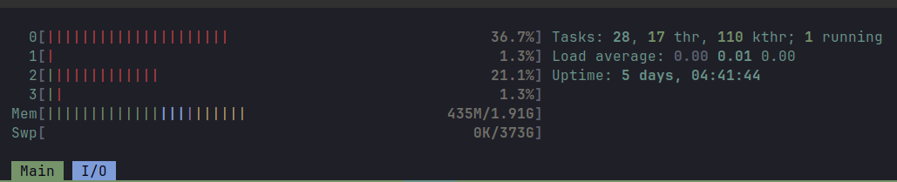

# NixOS based router in 2023 - Part 2 - Software

This is the second part of my journey of having NixOS based router on BananaPI R3 board (bpir3) in which I will focus more on the software side of things.
The first part is [here](../router2023/main.md), however reading it is not essential for understanding of this part.

Before we begin I want to briefly mention that there are two different ways to have a reproducible router. The obvious one that I took is to just install NixOS there and configure it to serve as a router.
The other one is to use OpenWRT, write your configuration in a declarative way and render set of uci commands to apply on an OpenWRT instance.
You can read more about the second approach here: https://github.com/Mic92/dotfiles/tree/main/openwrt

## Motivation

I decided to write this blog post because I enjoy sharing what I've learned. While researching, I came across several similar blog posts (references at the bottom) that were valuable learning resources.
However, some of them didn't cover all the aspects (e.g., Wi-Fi setup), relied on legacy approaches (e.g., network-manager), or involved complex and manual configurations.

My goal is for my setup to serve as a reference for future NixOS enthusiasts. I aim to keep it simple enough for an average developer, like myself, to follow along with ease.

> There is beauty in simplicity.

My configuration is public and can be found [here](https://github.com/ghostbuster91/nixos-router).

Last but not least, I am an application developer not a network expert, if you find anything in here to be incorrect please don't hesitate and contact me.

## IPv4 / IPv6

First, we need to choose whether we want to support both IPv6 and IPv4 or do only an IPv4 setup.
Depending on that choice we might have to chose some specific components for our software stack.

I decided to do only IPv4 setup because:

- it is much simpler than IPv6, as there is only one canonical way of doing things
- my ISP can only assign me either IPv4 or IPv6 not both, which I was told isn't the best idea (at least for now).
- last but not least I wanted to have something working without doing PhD from every single aspect :)

With this settled we can start setting up our router.

## Kernel

You thought that we wouldn't have to deal with the kernel anymore after part 1, didn't you?

By default, the Linux kernel is configured to discard network packets that are not destined for the interface on which they were received.
This effectively prevents any kind of routing, so we have to change it.

Add following lines to your nix configuration:

```nix
boot.kernel = {
  sysctl = {
    "net.ipv4.conf.all.forwarding" = true;
    "net.ipv6.conf.all.forwarding" = false;
  };
};
```

For now we have explicitly disabled IPv6 traffic. We will turn it on once we start to support IPv6.

## Interfaces

We need to configure our network interfaces. There are two ways to configure them under NixOS - either by using [networking.interface](https://search.nixos.org/options?query=networking.interfaces)
or [systemd.network](https://nixos.wiki/wiki/Systemd-networkd).
The second one is preferred if you have a static configuration that doesn't change much during its lifetime, which is exactly our case.

Let's quickly recall what network interfaces we have for our disposal in bpir3:


ETH1 and LAN5 are SFP sockets that we won't be using, which means that we are left with 1 wan interface, 4 lan and two Wi-Fi interfaces.

We can now write our first part of networkd configuration, that will enslave LAN interfaces and configure the WAN interface so that it can get the IP address from upstream (e.g. ISP).

```nix
  systemd.network = {
    wait-online.anyInterface = true;
    networks = {
      "30-lan0" = {
        matchConfig.Name = "lan0";
        linkConfig.RequiredForOnline = "enslaved";
        networkConfig = {
          ConfigureWithoutCarrier = true;
        };
      };
      # lan1 and lan2 look analogical
      "30-lan3" = {
        matchConfig.Name = "lan3";
        linkConfig.RequiredForOnline = "enslaved";
        networkConfig = {
          ConfigureWithoutCarrier = true;
        };
      };
      "10-wan" = {
        matchConfig.Name = "wan";
        networkConfig = {
          # start a DHCP Client for IPv4 Addressing/Routing
          DHCP = "ipv4";
          DNSOverTLS = true;
          DNSSEC = true;
          IPv6PrivacyExtensions = false;
          IPForward = true;
        };
        # make routing on this interface a dependency for network-online.target
        linkConfig.RequiredForOnline = "routable";
      };
    };
  };
```

As you can see there is almost no configuration for LAN interfaces, we only changed them to be managed by networkd and we specified that they should be `UP` even if they don't have the carrier attached.
This allows connecting the carrier afterwards.

A small note about `wait-online.anyInterface` - without this networkd activation would fail as it would be waiting until timeout is reached for all managed interfaces to come online.
It is not necessary to set it if all managed interfaces are always connected but this is not my case. I want to retain ability to plug and unplug cables when needed.

Next, we can install our new configuration. I recommend using `test` (`sudo nixos-rebuild test  --flake .`) command instead of `switch` while you are testing things as if anything goes wrong,
you will be able to reboot your device and it will use the last known configuration. Also, it is cleaner as it does not create new boot entry each time.

```sh
$ nixos-rebuild test  --flake .
```

Let's verify current state of network interfaces:

```sh
$ networkctl

IDX LINK    TYPE     OPERATIONAL SETUP
  1 lo      loopback carrier     unmanaged
  2 eth0    ether    off         unmanaged
  3 eth1    ether    off         unmanaged
  4 wan     dsa      routable    configured
  5 lan0    dsa      no-carrier  configured
  6 lan1    dsa      no-carrier  configured
  7 lan2    dsa      no-carrier  configured
  8 lan3    dsa      no-carrier  configured
  9 lan4    dsa      off         unmanaged

9 links listed.
```

eth0 and eth1 are SFP sockets and they are disabled in my setup.

### Bridging LAN interfaces

Since I want all my LAN interfaces to share the same address pool and to communicate within the local network without any restrictions it seems logical to connect them on the
[layer 2](https://www.juniper.net/documentation/us/en/software/junos/multicast-l2/topics/topic-map/layer-2-understanding.html) (`L2`) into a single bridge interface.
We will also advertise ourselves on that interface under `192.168.10.1/24` ip address.
This is the address under which other devices within the local network will be able to reach our router.

This can be fairly easy done with networkd:

```nix
{
    wait-online.anyInterface = true;
    netdevs = {
      # Create the bridge interface
      "20-br-lan" = {
        netdevConfig = {
          Kind = "bridge";
          Name = "br-lan";
        };
      };
    };
    networks = {
      # Connect the bridge ports to the bridge
      "30-lan0" = {
        matchConfig.Name = "lan0";
        networkConfig = {
          Bridge = "br-lan";
          ConfigureWithoutCarrier = true;
        };
        linkConfig.RequiredForOnline = "enslaved";
      };
      # lan1 and lan2 look analogical
      "30-lan3" = {
        matchConfig.Name = "lan3";
        networkConfig = {
          Bridge = "br-lan";
          ConfigureWithoutCarrier = true;
        };
        linkConfig.RequiredForOnline = "enslaved";
      };
      # Configure the bridge for its desired function
      "40-br-lan" = {
        matchConfig.Name = "br-lan";
        bridgeConfig = { };
        address = [
          "192.168.10.1/24"
        ];
        networkConfig = {
          ConfigureWithoutCarrier = true;
        };
      };
      "10-wan" = {
        # this stays the same
      };
    };
  }
```

## Routing

Having all the low-level network configuration in place we can finally setup some firewall rules.
For this we will use nftables. [Nftables](https://wiki.nftables.org/wiki-nftables/index.php/Main_Page) is a successor of [iptables](https://en.wikipedia.org/wiki/Iptables)
which due its declarative nature plays nicely with nix.

Below is almost my full nftables configuration that despite being quite simple is sufficient.

```nix
  networking = {
    hostName = "surfer";
    useNetworkd = true;
    useDHCP = false;

    # No local firewall.
    nat.enable = false;
    firewall.enable = false;

    nftables = {
      enable = true;
      ruleset = ''
        table inet filter {
          chain input {
            type filter hook input priority 0; policy drop;

            iifname { "br-lan" } accept comment "Allow local network to access the router"
            iifname "wan" ct state { established, related } accept comment "Allow established traffic"
            iifname "wan" icmp type { echo-request, destination-unreachable, time-exceeded } counter accept comment "Allow select ICMP"
            iifname "wan" counter drop comment "Drop all other unsolicited traffic from wan"
            iifname "lo" accept comment "Accept everything from loopback interface"
          }
          chain forward {
            type filter hook forward priority filter; policy drop;

            iifname { "br-lan" } oifname { "wan" } accept comment "Allow trusted LAN to WAN"
            iifname { "wan" } oifname { "br-lan" } ct state { established, related } accept comment "Allow established back to LANs"
          }
        }

        table ip nat {
          chain postrouting {
            type nat hook postrouting priority 100; policy accept;
            oifname "wan" masquerade
          }
        }
      '';
    };
  };
```

Each entry has a comment attach, so I won't go much into the details here but I want to point out few things.

As you can see there are no references to lan interfaces.
Instead we have the "br-lan" interface that is our bridge which represents our internal network.

The rules are pretty simple. We prevent any kind of outside traffic from reaching internal network and the router.
We trust all internal traffic that comes from "br-lan" to access router and the outside world (`wan`).
Established traffic from the outside (the one that originated internally) is allowed.

At the beginning I forgot to add rule for the loopback (`lo`) interface which prevented router itself from accessing the internet.

For those who don't like embedding configuration in strings there is [nixos-nftables-firewall](https://github.com/thelegy/nixos-nftables-firewall) project
which allows you to express nftables rules directly in nix.

At some point I [ported my configuration to it](https://github.com/ghostbuster91/nixos-router/commit/9fd38ec45d8b7801f0b89dd5d6efe16b68a7b1e2),
however I had to revert that because there are some things which cannot (yet?) be expressed using this project (e.g. hardware offloading).

## DNS and DHCP

Now that we have configured the routing aspect, our next step is to ensure that devices connecting to our network can obtain IP addresses.
To achieve this, we will activate a DHCP server on the router.

Popular choices include:

- [dnsmasq](https://thekelleys.org.uk/dnsmasq/doc.html)
- [kea](https://github.com/isc-projects/kea)

dnsmasq was recommended to me as a lightweight and reliable solution that will be a good fit for a small home network.
In addition can also act as a DNS resolver, but doesn't have to.

For DNS resolution we could pair it with [CoreDNS](https://github.com/coredns/coredns) or [Unbound](https://github.com/NLnetLabs/unbound), however I decided to use a unified setup with dnsmasq only.

Below is my full configuration with some explanation:

```nix
services.dnsmasq = {
    enable = true;
    settings = {
      # upstream DNS servers
      server = [ "9.9.9.9" "8.8.8.8" "1.1.1.1" ];
      # sensible behaviours
      domain-needed = true;
      bogus-priv = true;
      no-resolv = true;

      # Cache dns queries.
      cache-size = 1000;

      dhcp-range = [ "br-lan,192.168.10.50,192.168.10.254,24h" ];
      interface = "br-lan";
      dhcp-host = "192.168.10.1";

      # local domains
      local = "/lan/";
      domain = "lan";
      expand-hosts = true;

      # don't use /etc/hosts as this would advertise surfer as localhost
      no-hosts = true;
      address = "/surfer.lan/192.168.10.1";
    };
  };
```

`domain-needed = true` Ensures that DNS queries are only forwarded for domains that are not found in the local configuration.

`bogus-priv = true` Blocks DNS queries for IP address ranges that are typically considered private (e.g., `10.0.0.0/8`, `192.168.0.0/16`) to prevent accidental exposure of private resources.

`no-resolv = true` Prevents dnsmasq from using `/etc/resolv.conf` for DNS server configuration.

`cache-size = 1000` Specifies the size of the DNS query cache maintained by dnsmasq. It will store up to 1000 cached DNS queries to improve response times for frequently accessed domains.

`dhcp-range = [ "br-lan,192.168.10.50,192.168.10.254,24h" ]` Defines the DHCP range for IP address assignment to devices on the "br-lan" network.
IP addresses between 192.168.10.50 and 192.168.10.254 will be leased to clients, with a lease duration of 24 hours.

`interface = "br-lan"` Specifies the network interface ("br-lan") to which the DHCP server should be bound.

`no-hosts = true` Disables the use of the `/etc/hosts` file for DNS resolution. This ensures that the local hosts file is not used to override DNS resolution.

`domain = "lan"` Sets the local domain name to "lan". Combinded with `expand-hosts=true` will add `.lan` suffix to any local defined name when trying to resolve it.

`local = "/lan/"` Any domain ending with the specified string is treated as a local domain by dnsmasq.
When a local domain is encountered in DNS queries, dnsmasq will attempt to resolve it without consulting upstream DNS servers.

`address = "/surfer.lan/192.168.10.1"` Specifies a fixed IP address (`192.168.10.1`) for the domain "surfer.lan".

Once configured we can check our assigned address leases using following command:

```sh
$ cat /var/lib/dnsmasq/dnsmasq.leases

1699872784 68:ff:ff:ff:ff:ff 192.168.10.175 clientA 01:68:ff:ff:ff:27:61
1699873874 68:ff:ff:ff:ff:fe 192.168.10.71 clientB 01:e0:ff:ff:ff:5c:9a
1699880402 68:ff:ff:ff:ff:fb 192.168.10.116 clientC 01:66:ff:ff:ff:d3:6c
```

## Wi-Fi

**Behold**, this turned out to be more complicated than I thought. Basically there are two options out there:

1. [hostapd](https://w1.fi/hostapd/)
2. [iwd](https://iwd.wiki.kernel.org/)

Hostapd is a mature, fully-fledged solution; however, it suffers from not-so-great documentation, and its configuration is quite complex (Wi-Fi is complex in general).
On the other hand, we have iwd, which is a modern and minimalistic tool.

I was told that if I want to do anything beyond the very basics then I should use hostapd as iwd is still very limited in terms of its capabilities.

Hostapd it is then.

Below is very basic hostapd configuration for 2.4 GHz radio, that creates a single network that will be bridged to our `br-lan`.

```nix
services.hostapd = {
    enable = true;
    radios = {
      wlan0 = {
        band = "2g";
        countryCode = "PL";
        channel = 0; # ACS

        wifi4.enable = true;

        networks = {
          wlan0 = {
            ssid = "wifi-name";
            authentication = {
              mode = "wpa3-sae";
              saePasswordsFile = "password";
            };
            bssid = "36:b9:ff:ff:ff:ff";
            settings = {
              bridge = "br-lan";
            };
          };
        };
      };
  };
};
```

:warning: Note that this will put your Wi-Fi password into the nix-store in a pain text. Use [sops-nix](https://github.com/Mic92/sops-nix) to manage your secrets.

My actual hostapd configuration is more complex, and I believe it's crucial to describe the journey that led me to it.
Considering the intricacies of wireless networking, I've chosen to dedicate a separate blog post to this topic.

## Performance

So far we haven't done any performance tuning but it is always a good idea to create a baseline, that we will refer to in the future.

Bpir3 has four 1 GHz ethernet ports and 2.4 GHz and 5 GHz radios. It can be extended with 2.5 GHz ethernet ports using SFP sockets, but I haven't done it yet.

Let's first test the wired connection.

Run `iperf -s` on your router and `iperf -c router.ip -bdir`.

```sh
$ iperf -c 192.168.10.1 -bdir
Connecting to host 192.168.10.1, port 5201
[  5] local 192.168.10.22 port 58950 connected to 192.168.10.1 port 5201
[ ID] Interval           Transfer     Bitrate         Retr  Cwnd
[  5]   0.00-1.00   sec   116 MBytes   969 Mbits/sec    0   1.02 MBytes
[  5]   1.00-2.00   sec   112 MBytes   944 Mbits/sec    0   1.02 MBytes
[  5]   2.00-3.00   sec   111 MBytes   933 Mbits/sec    0   1.06 MBytes
[  5]   3.00-4.00   sec   112 MBytes   944 Mbits/sec    0   1.06 MBytes
[  5]   4.00-5.00   sec   112 MBytes   944 Mbits/sec    0   1.06 MBytes
[  5]   5.00-6.00   sec   112 MBytes   944 Mbits/sec    0   1.06 MBytes
[  5]   6.00-7.00   sec   111 MBytes   933 Mbits/sec    0   1.06 MBytes
[  5]   7.00-8.00   sec   112 MBytes   944 Mbits/sec    0   1.06 MBytes
[  5]   8.00-9.00   sec   112 MBytes   944 Mbits/sec    0   1.06 MBytes
[  5]   9.00-10.00  sec   112 MBytes   944 Mbits/sec    0   1.06 MBytes
- - - - - - - - - - - - - - - - - - - - - - - - -
[ ID] Interval           Transfer     Bitrate         Retr
[  5]   0.00-10.00  sec  1.10 GBytes   944 Mbits/sec    0             sender
[  5]   0.00-10.00  sec  1.10 GBytes   941 Mbits/sec                  receiver

iperf Done.
```

This was to be expected, we won't get anything more than that as we are limited by ethernet ports.

Let's check 2.4 GHz Wi-Fi:

```sh
$ iperf -c 192.168.10.1 -bdir
Connecting to host 192.168.10.1, port 5201
[  5] local 192.168.10.175 port 34724 connected to 192.168.10.1 port 5201
[ ID] Interval           Transfer     Bitrate         Retr  Cwnd
[  5]   0.00-1.00   sec  14.1 MBytes   118 Mbits/sec    0    532 KBytes
[  5]   1.00-2.00   sec  11.6 MBytes  97.1 Mbits/sec    0    663 KBytes
[  5]   2.00-3.00   sec  12.5 MBytes   105 Mbits/sec    0    894 KBytes
[  5]   3.00-4.00   sec  11.2 MBytes  94.4 Mbits/sec    0    986 KBytes
[  5]   4.00-5.00   sec  10.0 MBytes  83.9 Mbits/sec    0    986 KBytes
[  5]   5.00-6.00   sec  10.0 MBytes  83.9 Mbits/sec    0    986 KBytes
[  5]   6.00-7.00   sec  11.2 MBytes  94.4 Mbits/sec    0    986 KBytes
[  5]   7.00-8.00   sec  10.0 MBytes  83.9 Mbits/sec    0   1.02 MBytes
[  5]   8.00-9.00   sec  12.5 MBytes   105 Mbits/sec    0   1.07 MBytes
[  5]   9.00-10.00  sec  10.0 MBytes  83.9 Mbits/sec    0   1.07 MBytes
- - - - - - - - - - - - - - - - - - - - - - - - -
[ ID] Interval           Transfer     Bitrate         Retr
[  5]   0.00-10.00  sec   113 MBytes  94.9 Mbits/sec    0             sender
[  5]   0.00-10.03  sec   110 MBytes  92.4 Mbits/sec                  receiver

iperf Done.
```

Not great, not terrible. We can also notice that during both of our tests the CPU usage raised up to 37% which is quite high.



We will take care of both of these problems in the future.

## Security

:warning: First, let me remind you that I am not a network security expert and you should always do your own research or reach out to a real expert.

The most important part in my opinion are the rules for nftables which we have already covered.

We specified some additional options for dnsmasq like `bogus-priv` and `no-resolv` which also hardens the network.

It is a good practice to filter out [Martian packets](https://en.wikipedia.org/wiki/Martian_packet).
In order to prevent any such packet from getting through set `rp_filter=1` in kernel params:

```nix
boot.kernel = {
  sysctl = {
    "net.ipv4.conf.default.rp_filter" = 1
    "net.ipv4.conf.br-lan.rp_filter" = 1;
    "net.ipv4.conf.wan.rp_filter" = 1;
  };
};
```

Kernel documentation says:

- 0 - No source validation.
- 1 - Strict Mode as defined in RFC 3704 Strict Reverse Path. Each incoming packet is tested against the FIB and if the interface is not the best reverse path the packet check will fail.
  By default failed packets are discarded.
- 2 - Loose mode as defined in RFC 3704 Loose Reverse Path. Each incoming packet's source address is also tested against the FIB and if the source address is not reachable via any interface
  the packet check will fail.

_Based on https://pavluk.org/blog/2022/01/26/nixos_router.html_

## Epilog

No worries, this is not the end as we still have a lot to cover - performance improvements, Wi-Fi standards, configuring hostapd, and the broader subject of network observability.
At some point, I'd also like to discuss the issues I encountered after migrating my network to this router.
Perhaps in the future, I'll even consider expanding bpir3 with a 2.5 GHz Ethernet port.

Here's a list of resources I came across while researching this topic:

- https://www.jjpdev.com/posts/home-router-nixos/
- https://francis.begyn.be/blog/nixos-home-router
- https://dataswamp.org/~solene/2022-08-03-nixos-with-live-usb-router.html
- https://pavluk.org/blog/2022/01/26/nixos_router.html
- https://skogsbrus.xyz/building-a-router-with-nixos/

Many thanks to all the authors, the NixOS networking community, and, as usual, a couple of individuals who were there to help me when I got stuck:

- @nakato
- @k900
- @frank.w
- @ericwoud
